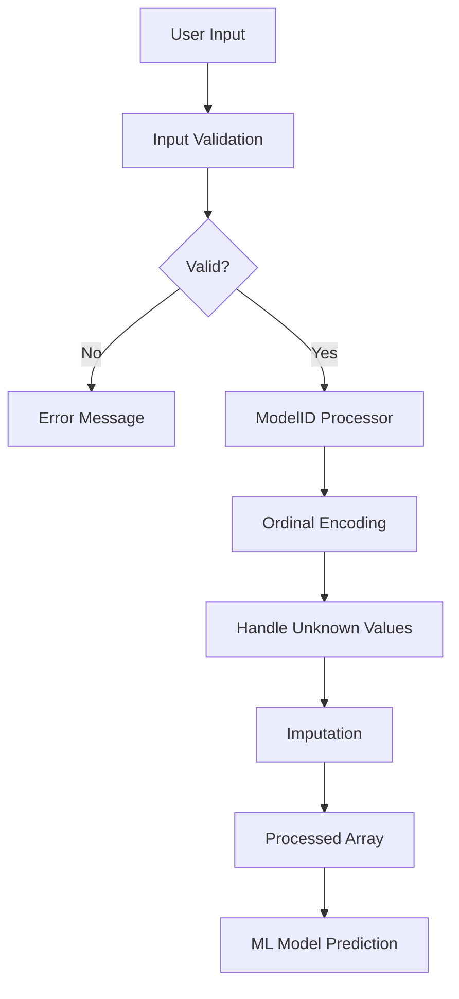

# ModelID Input Component Guide

## Overview

The ModelID Input Component is a comprehensive solution for handling ModelID inputs in the BulldozerPriceGenius web application. It provides robust validation, preprocessing, and error handling for ModelID values used in bulldozer price prediction.

## Features

### ✅ Input Validation
- **Integer-only validation**: Ensures only whole numbers are accepted
- **Range validation**: Validates ModelID is within reasonable bounds (1-100,000)
- **Required field validation**: Prevents empty submissions
- **User-friendly error messages**: Clear feedback for invalid inputs

### ✅ Preprocessing Pipeline
- **Categorical encoding**: Uses `OrdinalEncoder` for ML compatibility
- **Unknown value handling**: Gracefully handles unseen ModelID values
- **Missing value imputation**: Uses `SimpleImputer` with most frequent strategy
- **Feature order preservation**: Maintains correct position in prediction pipeline

### ✅ Error Handling
- **Robust exception handling**: Catches and handles preprocessing errors
- **Fallback mechanisms**: Provides safe defaults when errors occur
- **Comprehensive logging**: Detailed logging for debugging and monitoring
- **Graceful degradation**: Continues operation even with problematic inputs

## Installation and Setup

### Prerequisites
```bash
pip install streamlit pandas scikit-learn numpy
```

### File Structure
```
src/
├── components/
│   └── model_id_input.py          # Main component
examples/
├── model_id_prediction_demo.py    # Complete demo
tests/
├── test_model_id_input.py         # Test suite
docs/
└── ModelID_Component_Guide.md     # This guide
```

## Quick Start

### Basic Usage

```python
import streamlit as st
from src.components.model_id_input import create_model_id_input

# Create the input field
model_id = create_model_id_input()

if model_id is not None:
    st.success(f"Valid ModelID entered: {model_id}")
```

### Complete Integration

```python
from src.components.model_id_input import (
    create_model_id_input,
    preprocess_model_id_for_prediction,
    ModelIDProcessor
)

# 1. Get user input
model_id = create_model_id_input()

if model_id is not None:
    # 2. Load fitted processor (from your trained model)
    processor = load_your_fitted_processor()
    
    # 3. Preprocess for prediction
    processed_array, status = preprocess_model_id_for_prediction(
        model_id, processor
    )
    
    # 4. Use in prediction pipeline
    prediction = your_model.predict(processed_array.reshape(1, -1))
```

## Component API Reference

### `create_model_id_input()`

Creates a Streamlit input field with validation and help text.

**Returns:**
- `Optional[int]`: Validated ModelID integer or None if invalid

**Features:**
- Text input with placeholder examples
- Expandable help section explaining ModelID purpose
- Real-time validation with success/error messages
- Integration with Streamlit's session state

### `validate_model_id(model_id_input: str)`

Validates raw ModelID input from user.

**Parameters:**
- `model_id_input` (str): Raw input string from user

**Returns:**
- `Tuple[bool, Optional[int], Optional[str]]`: (is_valid, parsed_value, error_message)

**Validation Rules:**
- Must be a positive integer
- Range: 1 to 100,000
- No decimal values allowed
- Handles whitespace gracefully

### `ModelIDProcessor`

Handles ModelID preprocessing for machine learning.

#### Methods

**`fit(model_ids: pd.Series)`**
- Fits the processor on training ModelID data
- Stores known ModelIDs for validation
- Configures OrdinalEncoder and SimpleImputer

**`transform(model_id: Union[int, float, str])`**
- Transforms a single ModelID for prediction
- Handles unknown values gracefully
- Returns numpy array ready for ML models

### `preprocess_model_id_for_prediction(model_id, processor)`

Complete preprocessing pipeline with status information.

**Parameters:**
- `model_id` (int): Validated ModelID integer
- `processor` (Optional[ModelIDProcessor]): Fitted processor instance

**Returns:**
- `Tuple[np.ndarray, str]`: (processed_array, status_message)

## Data Flow



## ModelID in Price Prediction

### Why ModelID Matters

ModelID is a crucial categorical feature that significantly impacts bulldozer prices because:

1. **Manufacturing Specifications**: Different models have varying engine power, blade sizes, and capabilities
2. **Market Demand**: Popular models command higher prices
3. **Production Volume**: Rare models may be more valuable
4. **Feature Sets**: Advanced features increase value

### Preprocessing Strategy

1. **Categorical Treatment**: ModelID is treated as a categorical variable, not numeric
2. **Ordinal Encoding**: Preserves relationships while making data ML-compatible
3. **Unknown Handling**: New ModelIDs are handled through imputation
4. **Feature Position**: Maintains correct order in the feature vector

### Historical Data Insights

Based on the training dataset:
- **Range**: ModelIDs from 28 to 37,198
- **Unique Values**: 5,281 different ModelIDs
- **Most Common**: ModelID 4605 (5,348 occurrences)
- **Distribution**: Varies significantly across models

## Error Handling Strategies

### Input Level
```python
# Validation catches common errors
is_valid, value, error = validate_model_id("12.5")
# Returns: (False, None, "ModelID must be a whole number...")
```

### Processing Level
```python
# Processor handles unknown values
processor = ModelIDProcessor()
result = processor.transform(999999)  # Unknown ModelID
# Returns: Imputed value, no exception
```

### Pipeline Level
```python
# Complete pipeline with fallbacks
try:
    processed, status = preprocess_model_id_for_prediction(model_id)
except Exception:
    # Fallback to safe default
    processed = np.array([0.0])
```

## Testing

### Run Tests
```bash
# Run all tests
pytest tests/test_model_id_input.py -v

# Run specific test class
pytest tests/test_model_id_input.py::TestModelIDValidation -v

# Run with coverage
pytest tests/test_model_id_input.py --cov=src.components.model_id_input
```

### Test Coverage
- ✅ Input validation (valid/invalid cases)
- ✅ Processor fitting and transformation
- ✅ Unknown value handling
- ✅ Error scenarios and edge cases
- ✅ Data type compatibility
- ✅ Performance with large datasets

## Demo Application

Run the complete demo to see the component in action:

```bash
streamlit run examples/model_id_prediction_demo.py
```

The demo includes:
- Interactive ModelID input
- Real-time preprocessing visualization
- Simulated price prediction
- Technical implementation details
- Best practices showcase

## Best Practices

### For Developers

1. **Always validate inputs** before preprocessing
2. **Use fitted processors** from your trained model
3. **Handle errors gracefully** with informative messages
4. **Log important events** for debugging and monitoring
5. **Test edge cases** thoroughly

### For Users

1. **Enter ModelIDs as integers** (no decimals)
2. **Check the help section** for guidance
3. **Verify ModelID accuracy** before submission
4. **Review preprocessing status** messages

### For Production

1. **Cache fitted processors** for performance
2. **Monitor preprocessing errors** and unknown ModelIDs
3. **Update processors** when retraining models
4. **Implement proper logging** and error tracking

## Integration Examples

### With Existing Streamlit App

```python
# In your main prediction page
def prediction_page():
    st.title("Bulldozer Price Prediction")
    
    # ModelID input
    model_id = create_model_id_input()
    
    # Other inputs...
    year_made = st.number_input("Year Made", min_value=1950, max_value=2025)
    
    if model_id and year_made:
        # Process all inputs and make prediction
        make_prediction(model_id, year_made, ...)
```

### With ML Pipeline

```python
# In your prediction pipeline
def predict_price(model_id, other_features):
    # Preprocess ModelID
    processed_model_id, _ = preprocess_model_id_for_prediction(
        model_id, fitted_processor
    )
    
    # Combine features
    all_features = np.concatenate([
        processed_model_id,
        other_processed_features
    ])
    
    # Make prediction
    return trained_model.predict(all_features.reshape(1, -1))
```

## Troubleshooting

### Common Issues

**Issue**: "ModelID processor must be fitted before transformation"
**Solution**: Ensure you call `processor.fit()` before `transform()`

**Issue**: Input validation fails for valid integers
**Solution**: Check for extra whitespace or decimal points

**Issue**: Unknown ModelIDs cause errors
**Solution**: Use `handle_unknown='use_encoded_value'` in OrdinalEncoder

### Performance Tips

1. **Cache fitted processors** using `@st.cache_data`
2. **Batch process** multiple ModelIDs when possible
3. **Use appropriate data types** (int32 for ModelID)
4. **Monitor memory usage** with large datasets

## Contributing

To contribute to the ModelID component:

1. Fork the repository
2. Create a feature branch
3. Add tests for new functionality
4. Ensure all tests pass
5. Submit a pull request

## License

This component is part of the BulldozerPriceGenius project and follows the same licensing terms.
